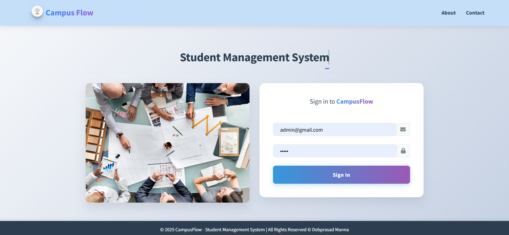
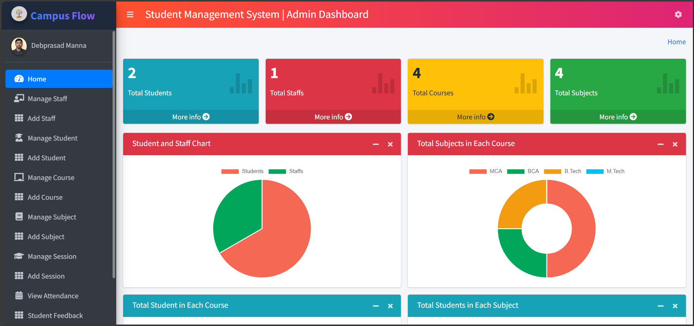
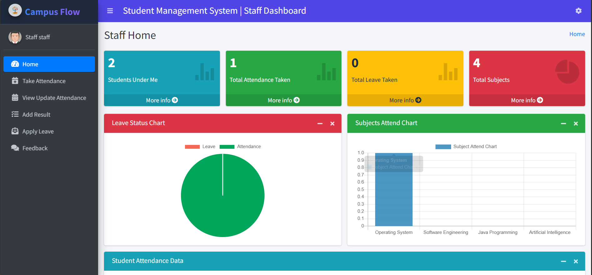

---

# 🎓 Django Student Management System (Beta)




A **Simple Student Management System** built with **Django** 🐍 for educational purposes. This project is a beginner-friendly implementation for learning Django's core concepts.

> 👨‍💻 Inspired by the tutorial series from **SuperCoders**.

---

## 🌐 Live Demo

🔗 **Check it out here:** [Live Demo](https://campus-flow.onrender.com/)

---

## ✨ Features

### 👑 Admin Users Can:

* 📊 View dashboard with summary charts for students, staff, courses, subjects, and leaves.
* 👨‍🏫 Manage **Staffs** — Add, Update, Delete.
* 🎓 Manage **Students** — Add, Update, Delete.
* 📚 Manage **Courses** — Add, Update, Delete.
* 📖 Manage **Subjects** — Add, Update, Delete.
* 🗓 Manage **Sessions** — Add, Update, Delete.
* 📅 View Student Attendance.
* 💬 Review and reply to Student/Staff feedback.
* 🗂 Approve/Reject Student and Staff Leave requests.

---

### 👨‍🏫 Staff/Teachers Can:

* 📊 View personalized dashboard with charts.
* ✅ Take and update student attendance.
* 📝 Add and update student results.
* 🗓 Apply for leave.
* 💌 Send feedback to HOD.

---

### 👨‍🎓 Students Can:

* 📊 View dashboard with personal academic stats.
* 📅 View attendance records.
* 🧾 View results.
* 🗓 Apply for leave.
* 💌 Send feedback to HOD.

---

## 🧪 Default Login Credentials

> Use these test accounts for quick exploration.

### 👨‍🏫 Staff

```
Email: staff@gmail.com
Password: staff
```

### 👨‍🎓 Student

```
Email: student@gmail.com
Password: student
```

---

## 🖼 Project Screenshots

### Admin Dashboard



### Staff Dashboard


### Student Dashboard



---

## 🛠 Tech Stack

* 🎯 **Python** & **Django**
* 🧩 **HTML**, **CSS**, **Bootstrap**
* 🗃 **SQLite** (default), or plug in PostgreSQL/MySQL
* 📦 AdminLTE for UI (Dashboard UI Framework)

---

## 🚀 Getting Started

Clone the project:

```bash
git clone https://github.com/Debprasad77/CampusFlow.git
cd CampusFlow
```

If You Faced Python Versions error.(Optional)

```bash
pip install legacy-cgi
```

Install dependencies:

```bash
pip install -r requirements.txt
```

Run migrations and start the server:

```bash
python manage.py makemigrations
python manage.py migrate
python manage.py runserver
```

---

## 🤝 Contributing

Pull requests are welcome! For major changes, please open an issue first to discuss what you would like to change.

---

## 📄 License

All rights Reserve to @Debprasad Manna 2025

---

## 📬 Connect With Me

* 💼 [LinkedIn](https://linkedin.com/in/debprasad77)
* 💻 [Portfolio](https://debprasadportfolio.vercel.app)

---
